# Operationalizing ML

In this project, the main focus is on Operationalizing Machine Learning models and training processes, so that it can bu used or triggered easily from external user applications. There are 2 segments of the project. 
The first is using the AzureML Studio to train a Classification model using AutoML and deploy it, which can then be consumed using an HTTP URL Endpoint. The second part of the project is to use the AzureML Python SDK to automate the training process by creating and publishing an AutoML training Pipeline.

## Architectural Diagram
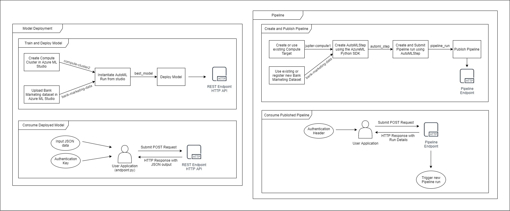

The diagram consists of 2 major sections, one for the Model Deployment (left), the second for the Pipeline (right)

### Model Deployment
This section of the diagram is further divided into 2 inter-related stages.
* The first stage is the stage of Model Training and Deployment, where a model is trained using AutoML and then deployed. The following steps were taken in the AzureML Studio:
  1. Created a Compute Cluster, that can be used for the AutoML run. The *Standard_DS12_v2* size cluster was created for this project, and was named *compute-cluster2* (as seen in diagram)
  2. Uploaded the Bank Marketing dataset from the [URL](https://automlsamplenotebookdata.blob.core.windows.net/automl-sample-notebook-data/bankmarketing_train.csv). The dataset was named as *bank-marketing-data*. 
  3. Used the created *compute-cluster2* and *bank-marketing-data* to start an AutoML Run to perform Classification on the data. The primary metric used was *Accuracy* and it was found that the **VotingEnsemble** model was the model with the best accuracy found by AutoML. (referred to as *best_model* in the diagram).
  4. This *best_model* was then deployed using Azure Container Instance (ACI) with authentication enabled, which generates a HTTP API Endpoint and the authorisation key that can be further consumed either using Swagger or through a user application to retrieve predictions from the trained model.
* The second stage is the stage of Consuming the Deployed Model using the HTTP API Endpoint generated from deploying the model. As authentication is enabled, the user application (endpoint.py) will have to use the Authentication Key to interact with the HTTP Endpoint. Hence the user application can use the Authentication Headers along with the data in JSON format to submit a POST request to the HTTP Model Endpoint. The HTTP API then responds back with the output data in JSON format.

### Pipeline
This section of the diagram too is further divided into 2 inter-related stages.
* The first stage is the creation and publishing of an AutoML training Pipeline. The following steps were implemented using the Python AzureML SDK in a Jupyter Notebook:
  1. Setting up the compute cluster for the pipeline, this could be either creating a new compute cluster or using an existing one. For this project, we used the same compute cluster that was used to run the Jupyter Notebook, called *jupyter-compute1*
  2. Setting up the dataset required for training. This could include registering the Bank Marketing dataset from the [URL](https://automlsamplenotebookdata.blob.core.windows.net/automl-sample-notebook-data/bankmarketing_train.csv) or using the existing dataset that was uploaded during the Model Deployment stage. In our case, the *bank-marketing-data* uploaded during the Model Deployment phase was used
  3. An AutoMLStep object *automl_step* was created with the required configurations, compute cluster and data.
  4. This *automl_step* was then used to create a Pipeline object, which was then submitted to instantiate a Pipeline Run.
  5. Once the pipeline_run execution was completed, it was then published under the name **Bankmarketing Train**, which generated a HTTP REST Endpoint. The Endpoint can then be consumed to trigger new pipeline runs.
* The second stage covers the consumption of the published Pipeline Endpoint, which is very similar to the steps required for Consuming a Deployed Model by the HTTP Endpoint. The user application that wishes to consume the Pipeline Endpoint must use an Authentication Header to submit a POST request to the HTTP Endpoint. This POST Request triggers a Pipeline Run in the AzureML Studio, and returns the details of the Run as a HTTP Response.

## Key Steps
An overview of the steps involved in the project and their relation was explained in the previous section. This section explains some of the key steps in more detail with the related screenshots.

### Part 1: AutoML Model Training, Deployment and Consumption 
#### **AutoML Model Training**
The first key step before training the model was to upload and register the Bank Marketing dataset in the AzureML Studio. The image below shows the dataset successfully registered under the name of *bank-marketing-data*.  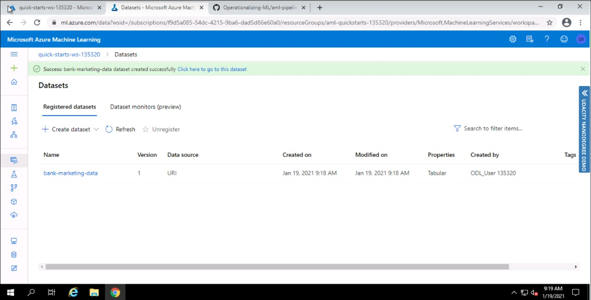  

The dataset and created compute cluster was then used to initiate an AutoML run to perform Classification on the dataset, to predict whether or not a particular client taking part in the marketing campaign will subscribe to a term deposit. The below image shows the AutoML Run completed succesfully. 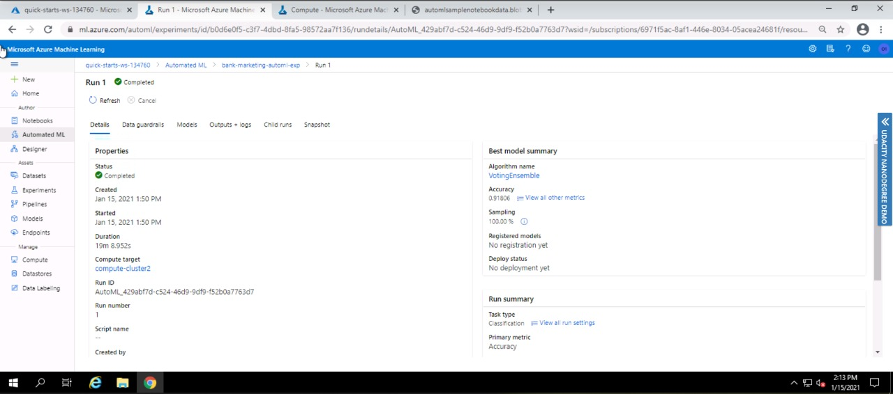    

The Azure Automated ML saves a lot of time by training different algorithms with different hyperparameters on the data to find the best performing model. The image below shows all the models trained by AutoML and their accuracies in decreasing order of performance. 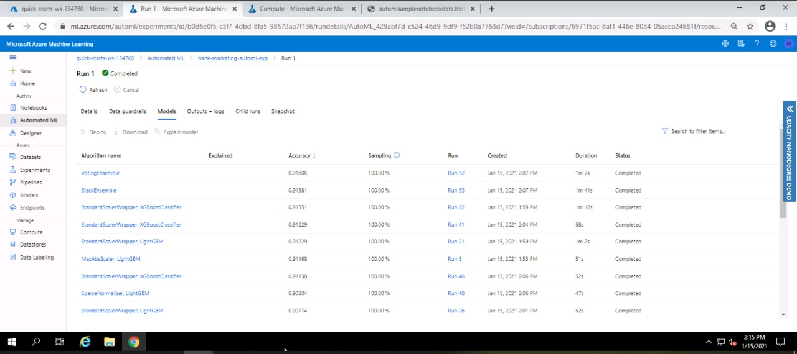  

It was found that the VotingEnsemble was the algorithm that perfomed best for the chosen primary metric *accuracy*. The image below shows the Model Summary of the trained VotingEnsemble model with the different performance metrics.  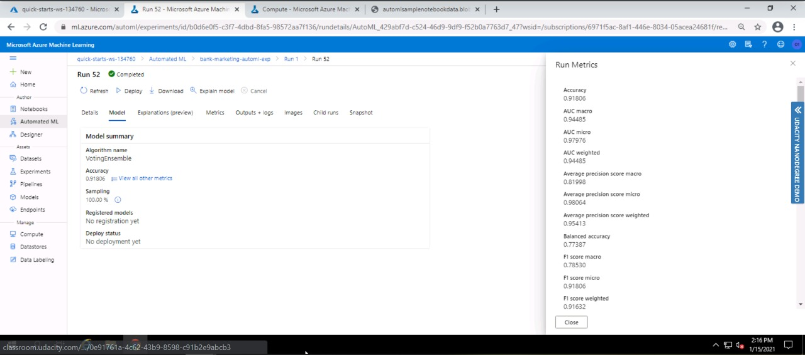  

#### **Deploying the model**
The VotingEnsemble model was then deployed using Azure Container Instance(ACI) and authentication enabled for security. In addition, it is always good practice to monitor the performance of a model after deployment, so as to check for any anomalies or performance bottlenecks during high requests. Azure provides the ApplicationInsights tool which allows for easy monitoring of depliyed models. Hence this feature was enabled after the model was deployed using the Python AzureML SDK. The below image shows the output of running the logs.py file which enables the Application Insights feature for the deployed model.  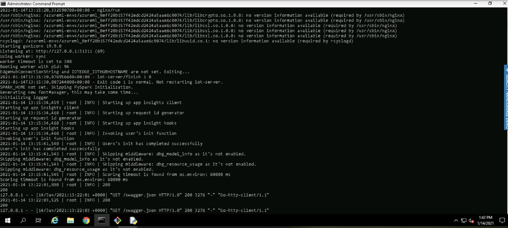   

Once the Application Insights was enabled using the SDK, the Studio also reflects the change and the shows the URL to access the insights generated by Azure, along with the REST Endpoint (HTTP API) to consume the model. This can be seen in the image below. 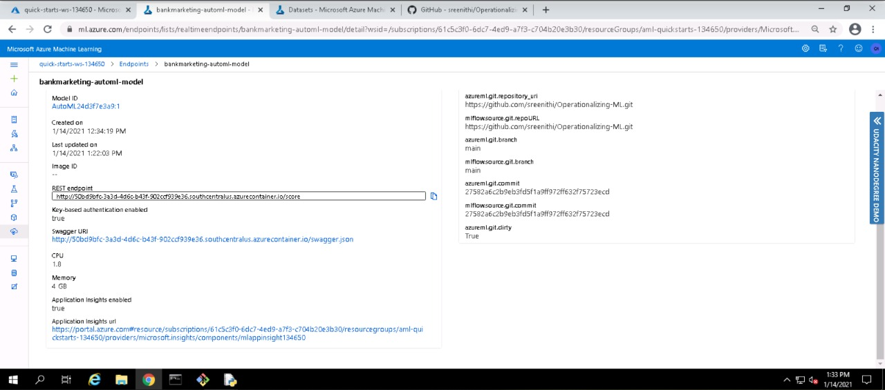  

Now that the model is deployed, the next step is to consume the model, i.e. interact with the Model using the HTTP API so as to receive the required output. This project implemented 2 different ways of consuming the deployed model as described below:
1. The first is using Swagger to consume the model. Among the different tools that Swagger provides, it also helps in documenting RESTful applications and explains what type of requests an application accepts. Microsoft Azure too provides a *swagger.json* file for the deployed model so as to help understand the requests and URLS that the generated REST Endpoint offers. 
    * To utilise this, swagger-ui was first downloaded and run locally using the Swagger UI docker container. 
    * To use the swagger.json file provided by Azure with swagger-ui, it had to be exposed on the localhost. Hence a HTTP Server was created using *swagger/serve.py* which exposes the working directory and *swagger.json* on localhost.
    * The swagger.json file with the localhost URL was then used in swagger-ui to generate the documentation of the REST Endpoint with details of the different URLs and HTTP Methods that it accepts. The below 2 images shows the documentation that was generated by Swagger.  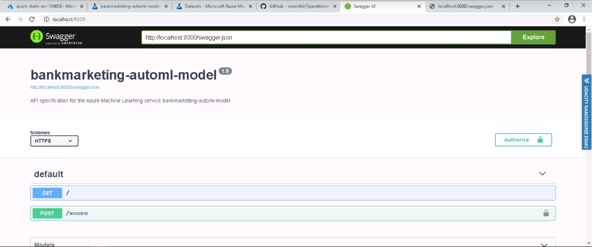 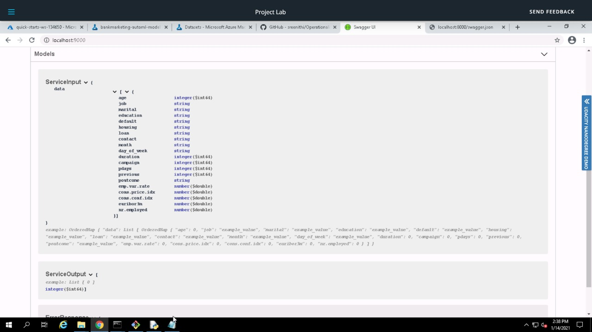  It can be seen that the Endpoint accepts a GET request to the base URL and a POST Request to the /score URL with input data required in the specified JSON format. The output provided by the POST Request is also in JSON format.
2. After understanding the available Request methods of the endpoint, the model can now be consumed to get the predictions based on data we provide. This was done using the *endpoint.py* file where the Authentication Key and input data in the format required by the Endpoint was set up and then a POST Request was sent to the HTTP API Endpoint. This triggers a model prediction using the supplied data, which then provides the output in JSON format. In our case, 2 sets of data were submitted to the endpoint, which then gave a JSON list of size 2 as the result, as shown in the image below.  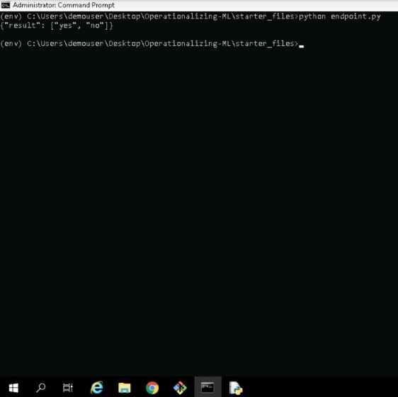  

### Part 2: Pipeline Creation, Publishing and Consumption
The second part of the project was about automating the entire training process into a Pipeline, and publishing it, so as to trigger training runs easily in future, by interacting with the created Endpoints. The Python AzureML SDK was used to create, publish and consume the pipeline. 
#### **1. Pipeline Creation**
The first step was to setup the configurations, data and compute cluster required for training as described in the Architecture Diagram section above. The configurations were setup using the *AutoMLConfig* Azure class, which was then used to create an *AutoMLStep* object. The object was then passed as a parameter to the Pipeline object and submitted to initiaite a Pipeline run. The image below shows the pipeline run successfully created and completed.  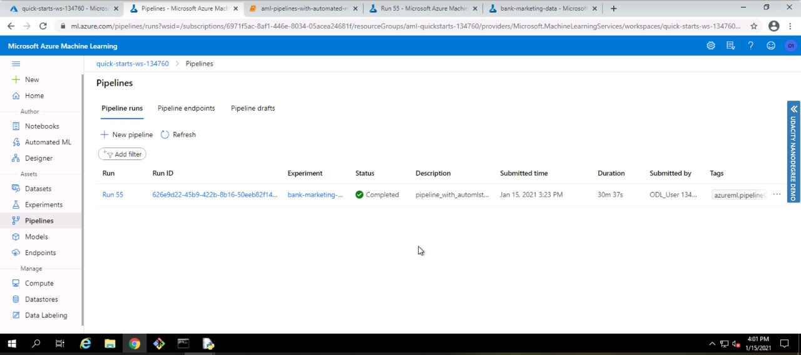  

#### **2. Publishing the Pipeline**
The created and completed pipeline run was then published using the *PipelineRun.publish_pipeline()* method to get a REST Endpoint. The image below shows the Pipeline Endpoint with the name *Bankmarketing Train* successfully created and active.  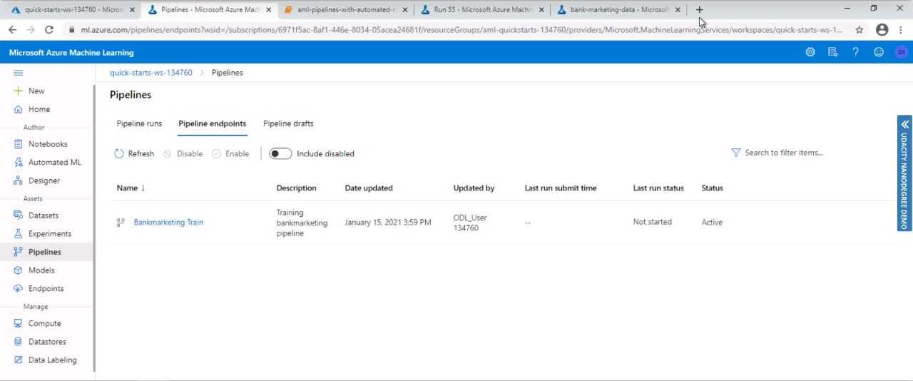  
On opening the Pipeline Endpoint page in the AzureML Studio, we can see the graphical representation of the pipeline with the dataset *bank-marketing-data* taken as the input training data for the *automl_module* as shown below. Hence, the final output of the pipeline is a trained model with the best accuracy found by AutoML.  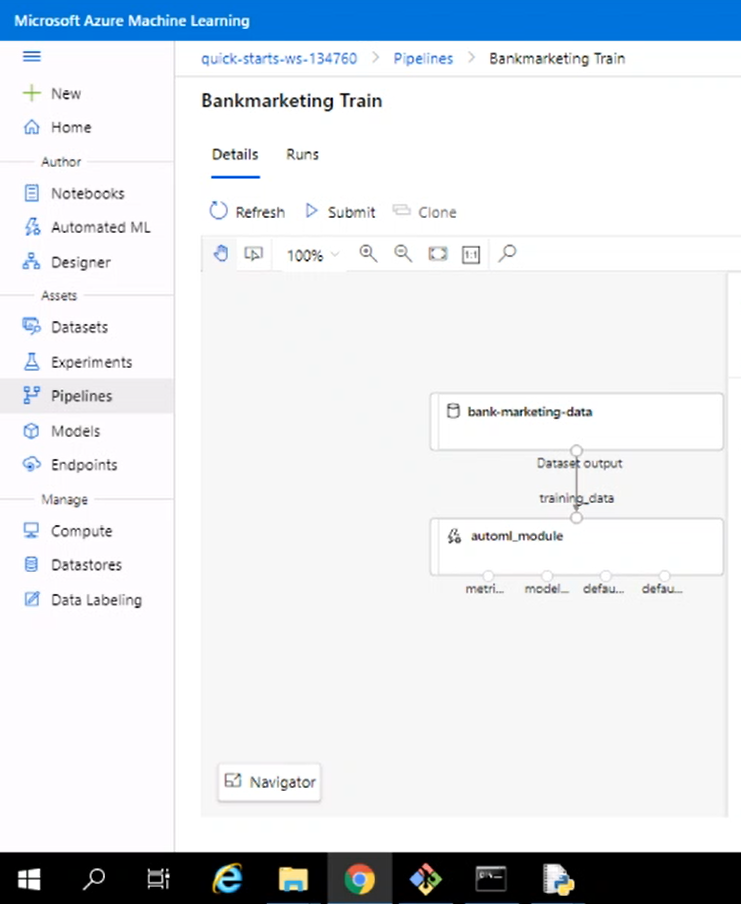  
On the same page, the 'Published Pipeline Overview' can be found which shows that the published endpoint is active and can be accessed using the given REST Endpoint URL  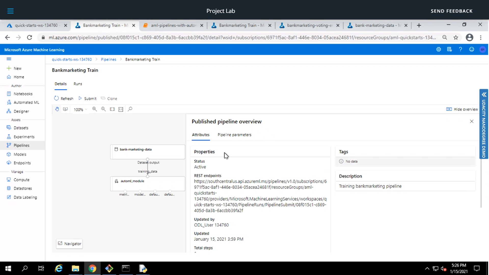  
The above screenshots show that the Pipeline has been successfully published and can now be consumed easily using HTTP Requests as discussed in the next subsection.  

#### **3. Consuming the Pipeline Endpoint**
Now that the pipeline has been published, it can be consumed by submitting a POST request to the REST Endpoint URL. The REST endpoint was retrieved using the Python AzureML SDK to which the HTTP POST request could be sent using the Python *requests* library. In addition, the POST request requires the appropriate authentication headers which were retrieved using the *InteractiveLoginAuthentication* AzureML class. Submitting the POST request, triggers a pipeline run in the studio creating a new trained AutoML model. The triggered run can be seen in the studio as shown in the image below. 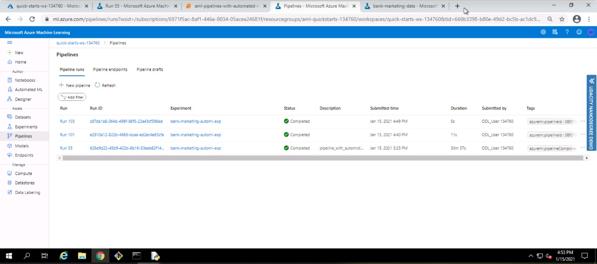  The triggered pipeline run can also be viewed in the Jupyter notebook using the *RunDetails* widget from the AzureML SDK. The output of the RunDetails can be seen in the image below.  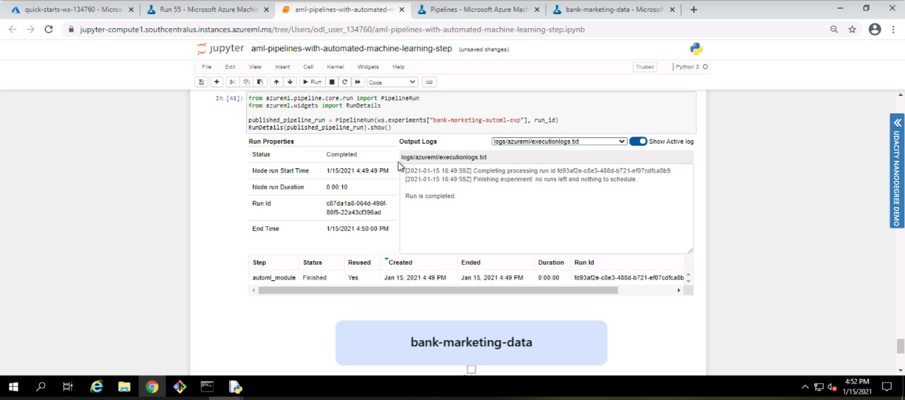  
It can hence be seen that the created pipeline has be published successfully and can be easily consumed to trigger a pipeline run, by a simple POST request.

## Screen Recording
Following is the link to the screencast of the project 
https://youtu.be/ESwOiEY4tjU

## Future Works
The Model Deployment part of the project currently uses a simple python script with 2 sets of data points to demo the prediction from the deployed model. In future this could be improved upon to build a web or mobile application that can collect data and interact with the endpoint to get predictions. 
 And secondly, in the Pipeline part of the project, as the primary focus was about operationalizing the ML model, the training process step was simplified using Azure AutoML and did not have any manual data cleaning or preparation done. But in future we can utilise further potential of the pipelines by adding PythonScriptSteps to perform data cleaning and preparation as well as use alternative training algorithms if required other than the AutoML.